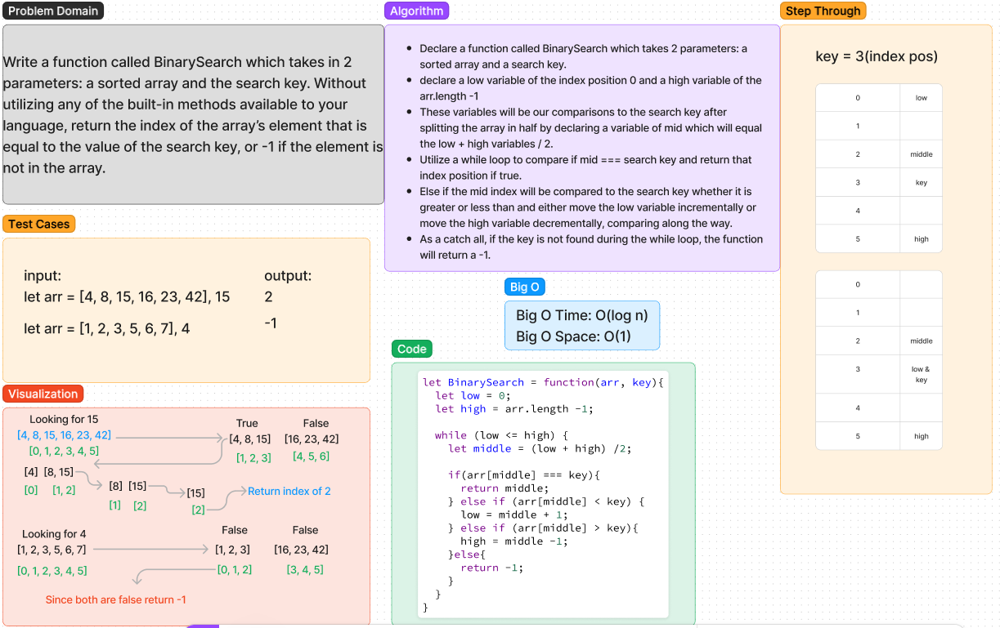

# Array Binary Search

Write a function called BinarySearch which takes in 2 parameters: a sorted array and the search key. Without utilizing any of the built-in methods available to your language, return the index of the array’s element that is equal to the value of the search key, or -1 if the element is not in the array.

## Whiteboard Process



## Approach & Efficiency

Kati and I used a while loop approach and broke the problem into segments.  Each part of the array was broken into low, middle, and high.  We used the conditional logic of a while loop to move through the array searching for the key based off whether it was greater or less than the middle index position and incrementting or decerementing the low and high variables to break out of the while condition after all positions had been tested.

Big O Time: O(log n)
Big O Space: O(1)

## Solution

```javascript
let BinarySearch = function(arr, key){
  let low = 0;
  let high = arr.length -1;

  while (low <= high) {
    middle = (low + high) /2

    if(arr[middle] === key){ // middle is compared to key and returns middle if true
      return middle;
    } else if (arr[middle] < key) { // middle index compares to key and adjust low if true
      low = middle + 1;
    } else if (arr[middle] > key){ // middle compares to key if greater adjusts high if true
      high = middle -1;
    }else{
      return -1; // returns -1 if key is not found by end of code execution
    }
  }
}
```
