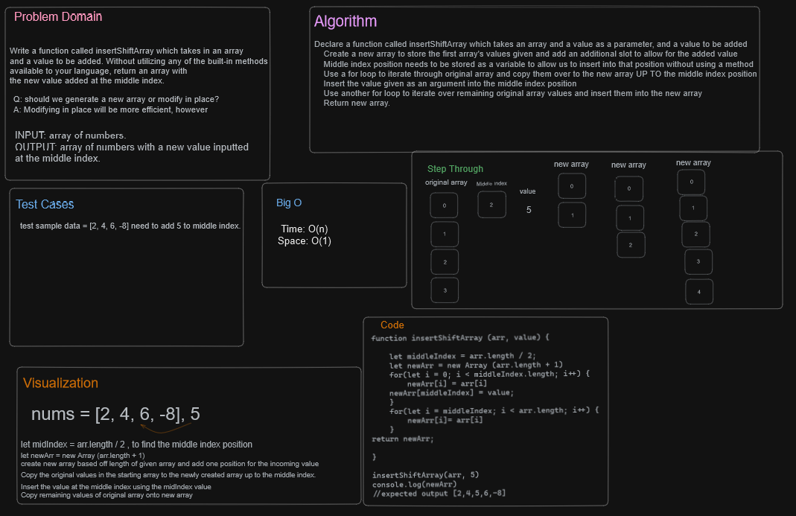

# Array Insert Shift

Write a function called insertShiftArray which takes in an array and a value to be added. Without utilizing any of the built-in methods available to your language, return an array with the new value added at the middle index.

## Whiteboard Process



## Approach & Efficiency

Kaeden and I decided to find the middle index of the array and stored it as a variable to allow for us to use that to insert the value.  We then iterated over the original array and inserted the values into the new array up to the middle index, then inserted the value into the middle index position. Lastly, pull the remaining values from the original array into the new array with another for loop.

Big O Time: O(n)

Big O Space: O(1)

## Solution

```javascript
  function insertShiftArray (arr, value) {
    let middleIndex = arr.length / 2;
    let newArr = new Array (arr.length / 2);
    for(let i = 0; i < middleIndex.length; i++){
      newArr[i] = arr[i]
      newArr[middleINdex] = value
    }
    for(let i = middleIndex; i < arr.length; i++){
      newArr[i] = arr[i]
    }
    return newArr;
  }
```
