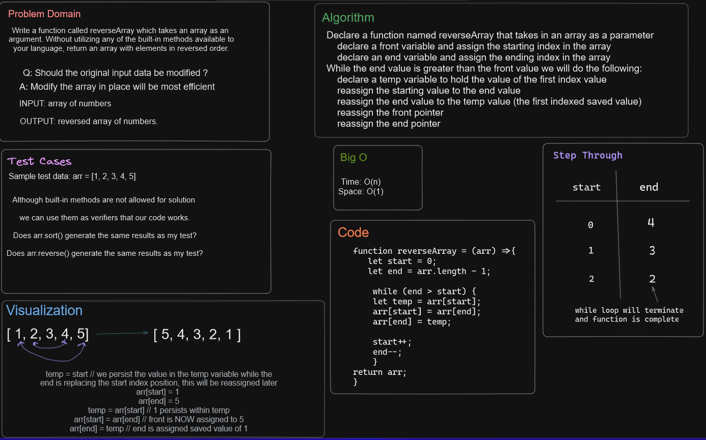

# Reversed arrays

Write a function called reverseArray which takes an array as an argument. Without utilizing any of the built-in methods available to your language, return an array with elements in reversed order.

## Whiteboard Process



## Approach & Efficiency

Given this was our first whiteboard challenge, I mimicked what Ryan Gallaway did for his approach to the problem.  I utilized a while loop that would allow for an array to be reversed in place to try and maximize efficiency. The Big O time would be O(n) while space would be O(1).

## Solution

```JavaScript
let arr = [1, 2, 3, 4, 5]
function reverseArray = (arr) =>{
   let start = 0;
   let end = arr.length - 1;

    while (end > start) {
    let temp = arr[start];
    arr[start] = arr[end];
    arr[end] = temp;

    start++;
    end--;
    }
return arr;
}
```

My code requires that an array be fed into the function as an argument.  So, taking arr = [1, 2, 3, 4, 5] will return [5, 4, 3, 2, 1];
