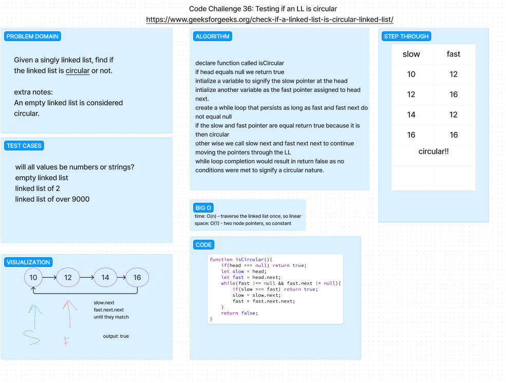

# CODE CHALLENGE 37: Circular Linked List

Write a function that tests whether a linked list is circular or not.

## Whiteboard Process

## Approach & Efficiency

Code challenge was found here: [DSA question on circular LL](https://www.geeksforgeeks.org/check-if-a-linked-list-is-circular-linked-list/)
We decided to try this challenge because it was something we had never seen before.  We had to do some research on how to approach this problem.  We found a solution that used two pointers, one that moved one node at a time and one that moved two nodes at a time.  If the two pointers ever pointed to the same node, then the linked list was circular.  If the faster pointer ever reached the end of the linked list, then the linked list was not circular.

## Solution

npm test circular-linkedList.test.js
