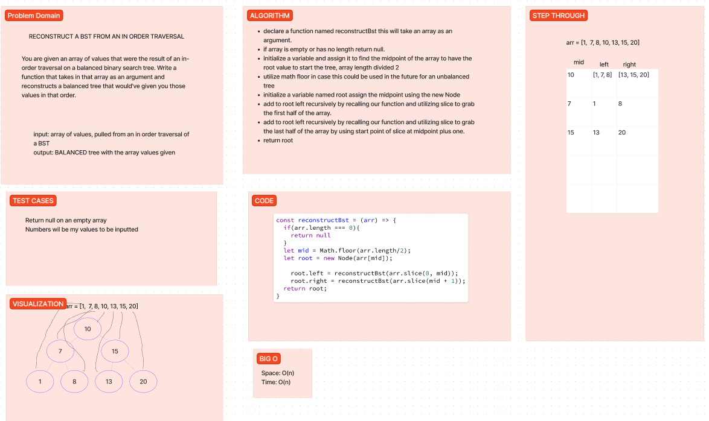

# Reconstruct a BST from a given array of values that were traversed in order

Write a function that reconstructs a balanced BST from a given array of values that were traversed in order.

## Whiteboard Process

## Approach & Efficiency

I had my final interview with Audrey today and was presented with this problem.  My first approach was to figure out how the array would look with a given tree structure that was traversed through to get the values.  I had to figure out where the midpoint was to understand where the root starts for the tree.  Once I had that midpoint I used it to initialize a new node as the tree root and then used a recursive function to traverse through the array and create new nodes for the left and right branches of the tree.  I used the same midpoint logic to find the midpoint of the left and right branches of the tree and then used those midpoints to create new nodes for the left and right branches of the tree.  I continued this process until I had no more values in the array to traverse through.  I then returned the root of the tree.

With this, I PASSED! So I am happy with my approach and solution.

## Solution

No tests were written since this was my final whiteboard interview
