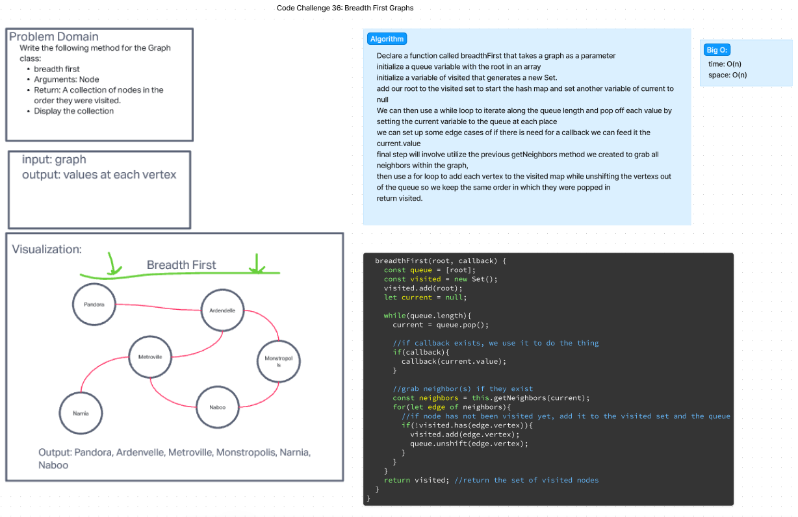

# Graphs

Implement your own Graph. The graph should be represented as an adjacency list, and should include the following methods:

    add node
        Arguments: value
        Returns: The added node
        Add a node to the graph
    add edge
        Arguments: 2 nodes to be connected by the edge, weight (optional)
        Returns: nothing
        Adds a new edge between two nodes in the graph
        If specified, assign a weight to the edge
        Both nodes should already be in the Graph
    get nodes
        Arguments: none
        Returns all of the nodes in the graph as a collection (set, list, or similar)
        Empty collection returned if there are no nodes
    get neighbors
        Arguments: node
        Returns a collection of edges connected to the given node
            Include the weight of the connection in the returned collection
        Empty collection returned if there are no nodes
    size
        Arguments: none
        Returns the total number of nodes in the graph
        0 if there are none

## Whiteboard Process

- This was not required for this code challenge

## Approach & Efficiency

This was original implementation with Ryan G so we just followed along. Testing was attempted after demo to understand how to test this code. Was able to complete 2 of the tests on my own, I used chat GPT to help with designing the rest as I couldn't get the jest syntax to be correct on what I wanted to find and return for the expectation.

## Solution

npm test graphs.test.js

\\\\\\\\\\\\\\\\\\\\\\\\\\\\\\\\\\\\\\\\\\\\\\\\\\\\\\\\\\\\\\\\\\\\\\\\\\\\\\\\\\\\\\\\\\\\\\\\\\\\\\\\\\\\\\\\\\\\\\\\\\\\\\\\\\\\\\\\\\\\\\\\\\\\\

# CODE CHALLENGE 36 : Breadth First for Graphs

Write the following method for the Graph class:

    breadth first
    Arguments: Node
    Return: A collection of nodes in the order they were visited.
    Display the collection

## Whiteboard Process

## Approach & Efficiency

We used a queue to keep track of the nodes that we popped off from the graph. We used a set to keep track of the nodes that we visited. We used a while loop to iterate over the queue. We used a for loop to iterate over the neighbors of the current node/vertex. We used a if statement to check if the neighbor was in the set of visited nodes. If it was not, we added it to the set and the queue. We returned the set of visited nodes.

## Solution

npm test graphs.test.js
