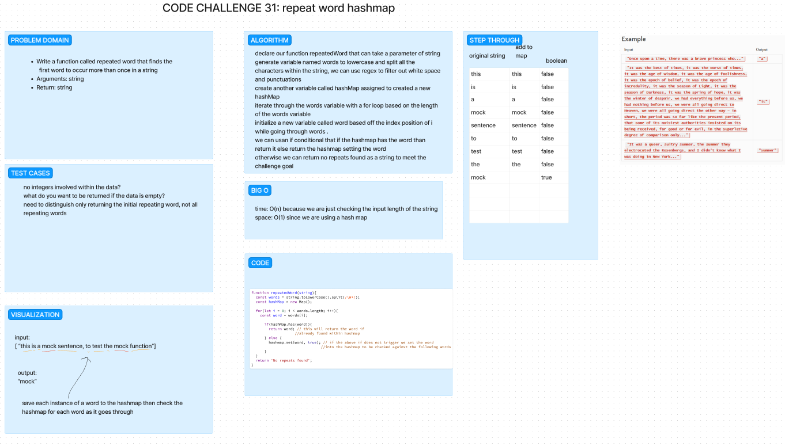

# Code Challenge 30: Hash Tables

Implement a Hashtable Class with the following methods:

    set
        Arguments: key, value
        Returns: nothing
        This method should hash the key, and set the key and value pair in the table, handling collisions as needed.
        Should a given key already exist, replace its value from the value argument given to this method.
    get
        Arguments: key
        Returns: Value associated with that key in the table
    has
        Arguments: key
        Returns: Boolean, indicating if the key exists in the table already.
    keys
        Returns: Collection of keys
    hash
        Arguments: key
        Returns: Index in the collection for that key

then create jest tests.

## Whiteboard Process

no whiteboard was required today.

## Approach & Efficiency

Today was following along with Ryan during implementation so no whiteboard was needed, we just focused on trying to develop tests for each new function created for the hashTable class.

## Solution

npm test hash-table.test.js

\\\\\\\\\\\\\\\\\\\\\\\\\\\\\\\\\\\\\\\\\\\\\\\\\\\\\\\\\\\\\\\\\\\\\\\\\\\\\\\\\\\\\\\\\\\\\\\\\\\\\\\\\\\\\\\\\\\\

# Code Challenge 31: Hash Map repeating words

    Write a function called repeated word that finds the first word to occur more than once in a string
    Arguments: string
    Return: string

then create jest tests.

## Whiteboard Process

## Approach & Efficiency

Today my partner showed up pretty late so I got to work on my own.  I knew the first issue was going to be figuring out to break apart each word of the string and add it to something to compare off of.  I used online tools to help generate regex to get rid of white space/punctuation that would cause issues with adding just the word itself.  Then it was just trying to figure out how we can get the word to be added to a hash table and then check if it already exists.  I used a while loop to check if the word already existed and if it did, return that word.  If it didn't, add it to the hash table and continue on.  I think this is a pretty efficient way to do it, but I'm sure there are better ways to do it.

## Solution

npm test hash-table.test.js
