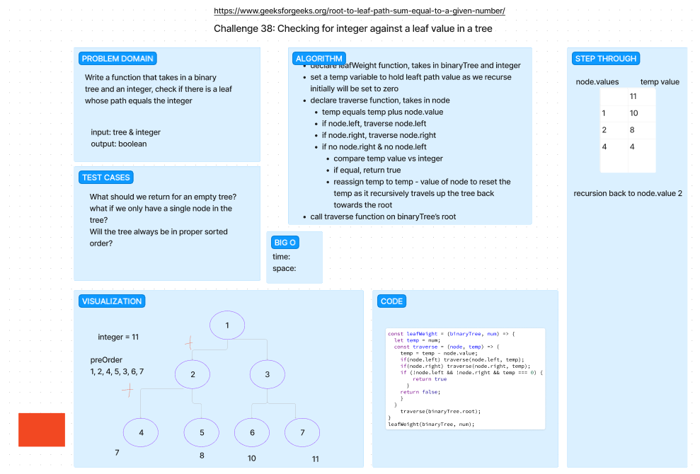

# Leaf Weight Check with Trees

Write a function that takes in a binary tree and an integer, and checks to see if the sum of the leaf nodes is equal to the integer passed in.

## Whiteboard Process

## Approach & Efficiency

We tried to approach this problem with traversing through a tree and storing a temp variable equal to the branch weight as we make our way down to the leaf node.  Once we reach the leaf node, we check the temp variable vs the given integer to see if the given weight is equal to our temp value.  If it is, we return true, if not, we return false. We then reset the temp variable to 0 and traverse back up the tree to the next branch.  We repeat this process until we have traversed the entire tree. If we have not found a match, we return false.

## Solution

npm test leaf-weight-tree

()
