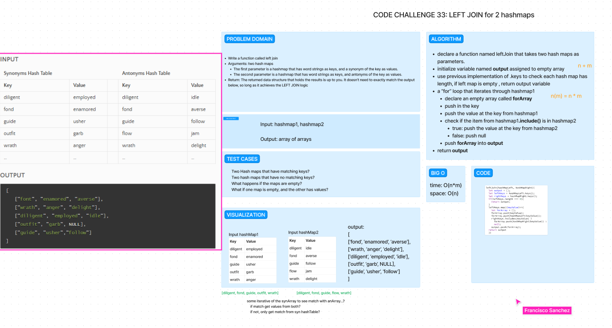

# Code Challenge 33: Tree Intersection

Write a function that LEFT JOINs two hashmaps into a single data structure.

    Write a function called left join
    Arguments: two hash maps
        The first parameter is a hashmap that has word strings as keys, and a synonym of the key as values.
        The second parameter is a hashmap that has word strings as keys, and antonyms of the key as values.
    Return: The returned data structure that holds the results is up to you. It doesn’t need to exactly match the output below, so long as it achieves the LEFT JOIN logic

then create jest tests.

## Whiteboard Process

## Approach & Efficiency

Today, we had Ryan G step in and help guide us on our whiteboard. We were struggling with trying to visualize how we would run through the hash maps and check for matching  keys to grab values from the second hash map to push into the first. We think we got a working solution, but even with Ryan G's help, we went well over an hour before event coming to try and code it up and write tests.

big o is O(n*m) for time and O(n) for space

## Solution

npm test left-join.test.js

