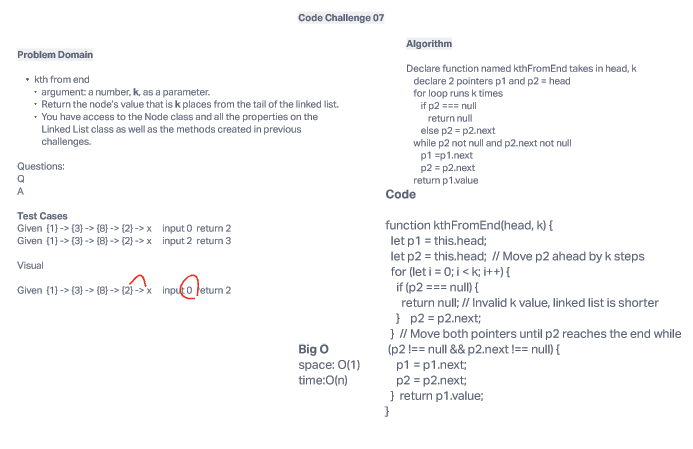

# Linked List Kth

Write the following method for the Linked List class:

    kth from end
        argument: a number, k, as a parameter.
        Return the node’s value that is k places from the tail of the linked list.
        You have access to the Node class and all the properties on the Linked List class as well as the methods created in previous challenges.

## Whiteboard Process

## Approach & Efficiency

My partner and I ended up utilizing google fu to find sample codes that were similar to what we needed to solve and adapted to what we needed. Nothing was copied. I am still practicing on understanding my Big O formula so I put our method into chatGPT to calculate and our time is O(1) and space is O(n).

## Solution

npm test linked-list , I added this method onto the original challenge as instructed.

