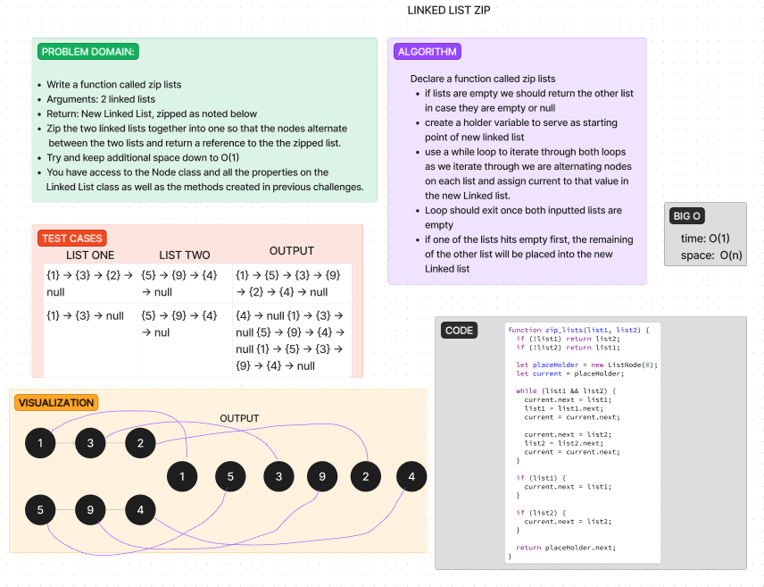

# Linked List Kth

Write the following method for the Linked List class:

    Write a function called zip lists
    Arguments: 2 linked lists
    Return: New Linked List, zipped as noted below
    Zip the two linked lists together into one so that the nodes alternate between the two lists and return a reference to the the zipped list.
    Try and keep additional space down to O(1)
    You have access to the Node class and all the properties on the Linked List class as well as the methods created in previous challenge


## Whiteboard Process



## Approach & Efficiency

 Big O time: O(1) because we will only ever be manipulating one node at a time within our loop

 Big O space: O(n), since we are using a singular loop

 I attempted to solve the code portion of this by myself today without using google or AI. However, I was not able to properly get the code to iterate alternatively on my own.  I utilized chatGPT and plugged in the prompt from challenge and from the while loop down it helped me alternatively grab nodes from each list and set up contigency in case 1 list ended before the other to feed in the remaining nodes to the new linked list.

## Solution

``` javscript

function zip_lists(list1, list2) {
  if (!list1) return list2;
  if (!list2) return list1;

  let placeHolder = new ListNode(0);
  let current = placeHolder;

  while (list1 && list2) {
    current.next = list1;
    list1 = list1.next;
    current = current.next;

    current.next = list2;
    list2 = list2.next;
    current = current.next;
  }

  if (list1) {
    current.next = list1;
  }

  if (list2) {
    current.next = list2;
  }

  return placeHolder.next;
}
```

