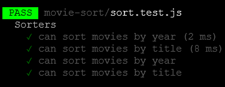

# Code Challenge:

When sorting an array, a key step in the algorithm is determining what their order should be. In the insertion sort algorithm, the insertion phase has a while loop that checks for whether the number to insert is less than the number at the iteration index. The first time the number to insert is greater, the algorithm inserts at the previous index. Merge Sort applies the same logic when recombining sub-arrays, as it needs to choose whether to pull from the left or the right array.

## Whiteboard Process

- This was not required for this code challenge

## Approach & Efficiency

We approached the problem as a team at table 4.  We discussed the problem and how we would solve it.  We then broke up the problem into smaller pieces and each team member took pieces of the code to work on and pair programmed.

## Solution

npm test sort.test.js

