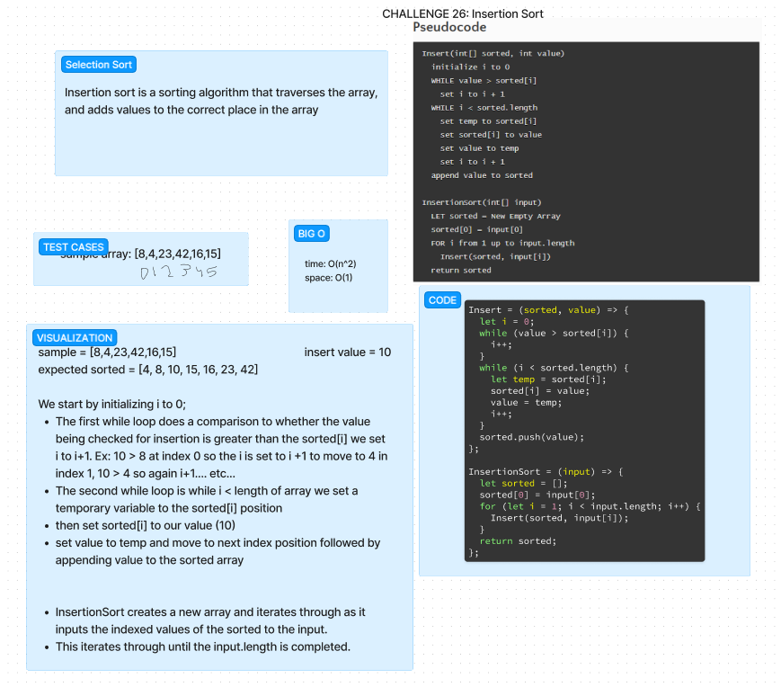

# Challenge Title: Insertion Sort

Review the pseudocode below, then trace the algorithm by stepping through the process with the provided sample array. Document your explanation by creating a blog article that shows the step-by-step output after each iteration through some sort of visual.

Once you are done with your article, code a working, tested implementation of Insertion Sort based on the pseudocode provided.

## Whiteboard Process

## Approach & Efficiency

I have no idea, I spent an hour just trying to get the functions to work.  I'm not sure what I'm doing wrong.  I'm going to have to come back to this one.

Big O space: O(n^2)
Big O time: O(1)

## Solution

npm test while in the insertion-sort directory
