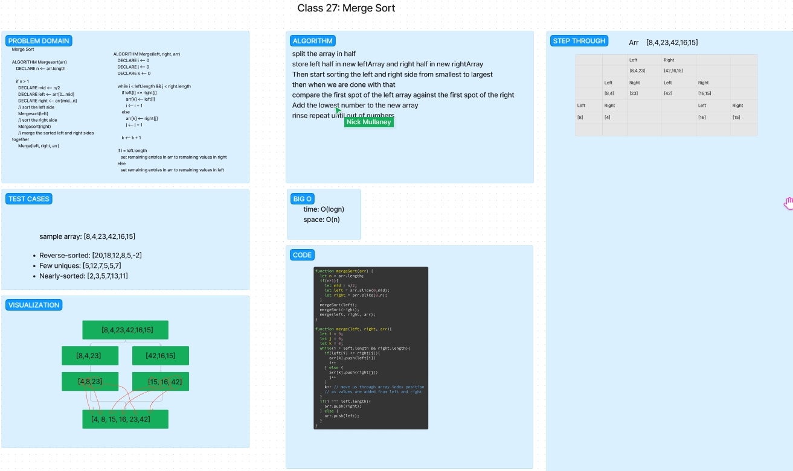

# Challenge Title: Merge Sort

Review the pseudocode below, then trace the algorithm by stepping through the process with the provided sample array. Document your explanation by creating a blog article that shows the step-by-step output after each iteration through some sort of visual.

Once you are done with your article, code a working, tested implementation of Merge Sort based on the pseudocode provided.

## Whiteboard Process

## Approach & Efficiency

We broke down each segment of the merge sort into its own function.  We then called the functions in the order that they would be called in the merge sort.  We then tested the functions to make sure that they were working properly.  We then tested the merge sort function to make sure that it was working properly. I utilized ChatGPT to troubleshoot our code when it was not operating and leveraged the AI in making tests.

Big O space: O(logn)
Big O time: O(logn)

## Solution

npm test while in the insertion-sort directory
