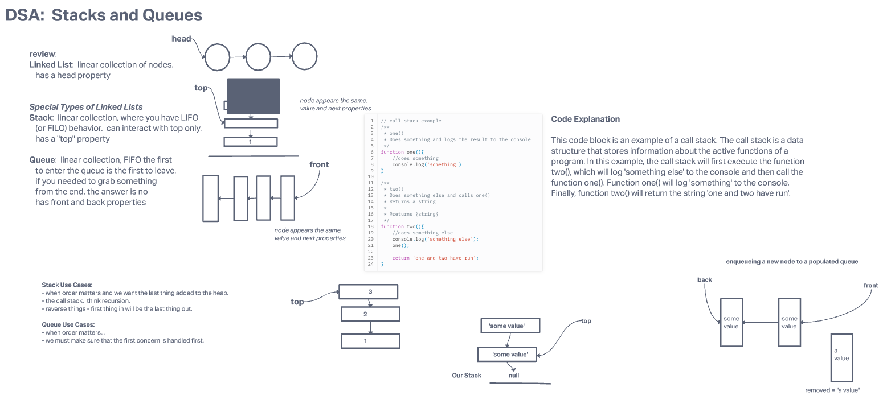
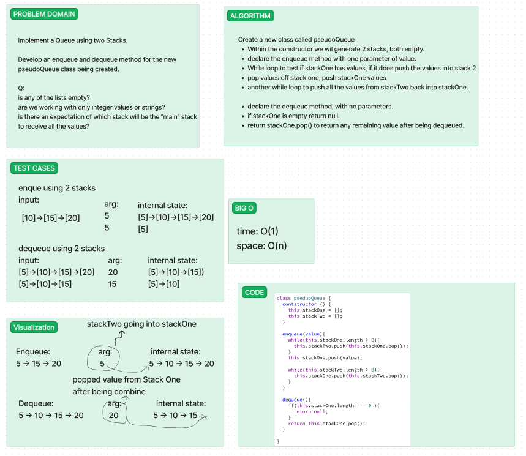
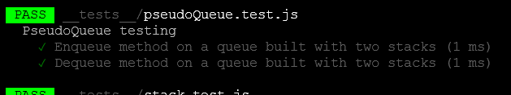
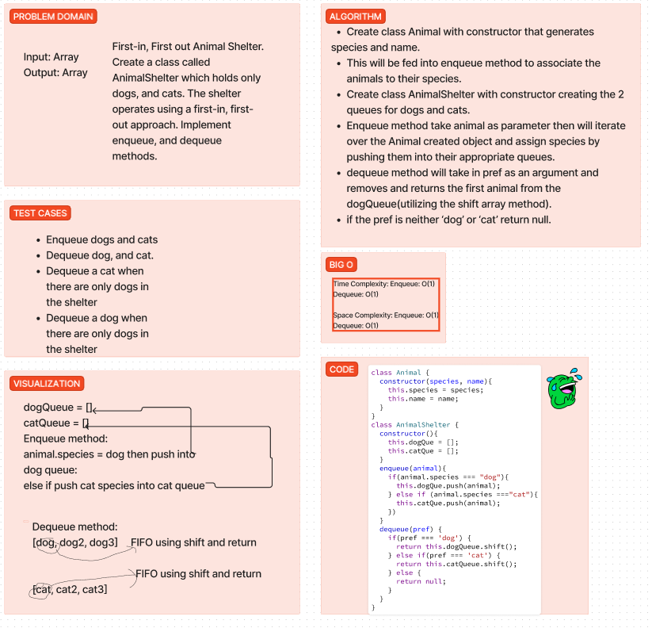
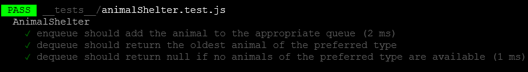
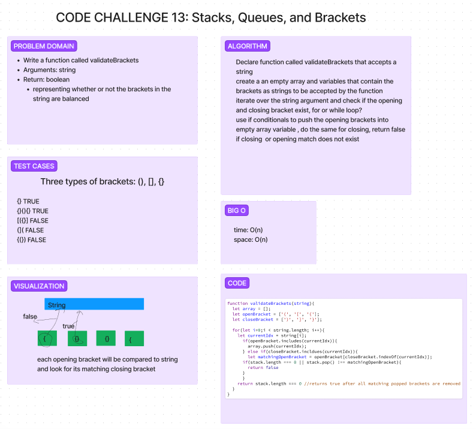

# Code Challenge 10: Stacks and Queues

Implement stack and queues that will pass all the provided tests:

    Can successfully push onto a stack
    Can successfully push multiple values onto a stack
    Can successfully pop off the stack
    Can successfully empty a stack after multiple pops
    Can successfully peek the next item on the stack
    Can successfully instantiate an empty stack
    Calling pop or peek on empty stack raises exception
    Can successfully enqueue into a queue
    Can successfully enqueue multiple values into a queue
    Can successfully dequeue out of a queue the expected value
    Can successfully peek into a queue, seeing the expected value
    Can successfully empty a queue after multiple dequeues
    Can successfully instantiate an empty queue
    Calling dequeue or peek on empty queue raises exception

## Whiteboard Process

Whiteboard was taken from lecture this challenge

## Approach & Efficiency

After following along with Ryan throughout the lecture I was able to figure out the stack tests which resulted in me being able to build out the queue tests up until the calling dequeue or peek on empty queue tests.  I was unable to get that test to pass so I utilized ChatGPT to help me fix that portion of the test.

Stacks Big O time and space:
push(): O(1) & O(1).
pop(): O(1) & O(1).
peek(): O(1) & O(1).
isEmpty(): O(1) & O(1).

Queue Big O time and space:
enqueue(): O(1) & O(1).
dequeue(): O(1) & O(1).
peek(): O(1) & O(1).
isEmpty(): O(1) & O(1).

## Solution

npm test to run all suites or npm test (fileName)

////////////////////////////////////////

# CODE CHALLENGE 11: Create a queue with two stacks

Develop a queue with 2 stacks that has the enqueue and dequeue methods we learned from our previous challenge

## Whiteboard Process

<!-- Embedded whiteboard image -->

## Approach & Efficiency

We took 45 minutes to try and break the problem down into the smallest parts we could understand.  We were able to get everything up to the code, but had issues with solving the correct way to combine the stacks into one que so we asked ChatGPT for help with that portion.
BIG O:
Enqueue
time/space: O(n) since we only manipulating elements within one queue after the initial while loop completes

Dequeue
time/space: O(1) since we are simply pulling the top off the stack

## Solution

npm test stack-and-queue will run all tests attached to these code challenges

///////////////////////////////////////////////////

# CODE CHALLENGE 12: Create a queue with two Stacks containing objects: AnimalShelter class

Develop a queue with 2 stacks that has the enqueue and dequeue methods we learned from our previous challenge, that expands on containing objects with multiple properties to assign to stacks based on species and preference.

## Whiteboard Process

## Approach & Efficiency

We took 45 minutes to try and break the problem down into the smallest parts we could understand.  We were able to get everything up to the code, but had issues with solving the correct way to combine the stacks into one que so we asked ChatGPT for help with that portion.

BIG O:
Enqueue
time/space: O(n) since we only manipulating elements within one queue at any given time as species types are pushed into their matching arrays

Dequeue
time/space: O(1) since we are simply pulling the top off the stack using shift.

## Solution

npm test stack-and-queue will run all tests attached to these code challenges.

////////////////////////////////////////////////

# CODE CHALLENGE 13: Multi-bracket Validation

Write a function called validate brackets that accepts strings as arguments and returns a boolean whether or not the brackets in the string are balanced.

## Whiteboard Process

## Approach & Efficiency

My partner and I got about 50% of the way through the code portion of the whiteboard.  We were able to figure out most of the logic but we hit a wall with trying to figure out how to do a comparison of the open and close brackets are their indexed positions to solve the issue.  We were getting near the one hour mark so we utilized ChatGPT to help figure out what we were missing.  We got really close so I felt proud of that since the question felt much harder than yesterdays.
BIG O time and space is O(n) since we are only every manipulating one index position while comparing it to the created strings to test against and when the logic portion of comparing them to their indexed position we are only comparing a variable against an indexed position.

## Solution
npm test while inside the stack-and-queue folder to run all tests

//////////////////////////////////////////////////

# Challenge Title
<!-- Description of the challenge -->

## Whiteboard Process
<!-- Embedded whiteboard image -->

## Approach & Efficiency
<!-- What approach did you take? Why? What is the Big O space/time for this approach? -->

## Solution
<!-- Show how to run your code, and examples of it in action -->
