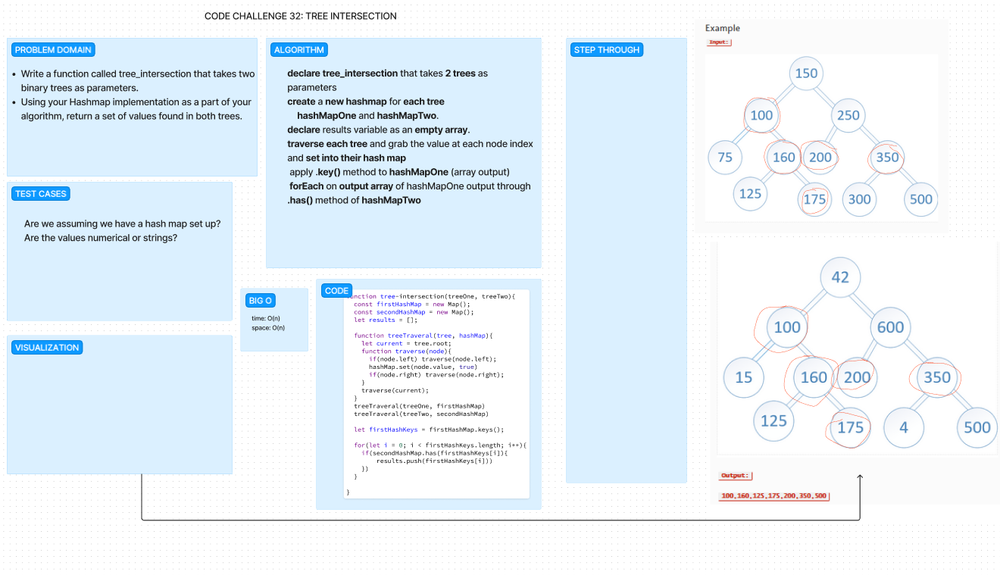

# Code Challenge 32: Tree Intersection

    Write a function called tree_intersection that takes two binary trees as parameters.
    Using your Hashmap implementation as a part of your algorithm, return a set of values found in both trees.

then create jest tests.

## Whiteboard Process

## Approach & Efficiency

Cisco and I utilized the logic from the previous code challenge to try and generate two hash maps full of values from the trees to then do a comparison against and push the value into a results array if both maps contained that key. We ran into some issues with how we would do the comparison and what we would need to grab to push into the results array. We are not sure if our way is the most efficient way to do this, but its how we could think to solve it.

## Solution

npm test tree-intersection.test.js

