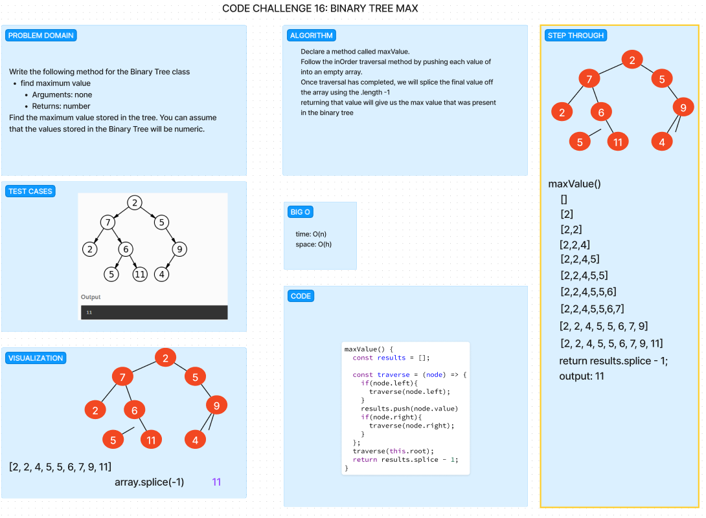

# Code Challenge 15: Binary Tree and BST Implementation
Binary Tree

    Create a Binary Tree class
        Define a method for each of the depth first traversals:
            pre order
            in order
            post order
        Each depth first traversal method should return an array of values, ordered appropriately.

Binary Search Tree

    Create a Binary Search Tree class
        This class should be a sub-class (or your languages equivalent) of the Binary Tree Class, with the following additional methods:
        Add
            Arguments: value
            Return: nothing
            Adds a new node with that value in the correct location in the binary search tree.

## Whiteboard Process

## Approach & Efficiency

Google Fu was our approach.  We were able to figure out part of the add functionality but we could not get it to pass any type of tests so we knew that it was incorrect.  There are lots of examples of how to traverse and add or complete the contain methods so we tried to use that as reference and build out a way to get to the solution on our own but we spent over 2 hours and ultimately decided to use Chat GPT to help debug and figure out what was going on.  The big o time is O(h) due to dealing with the height of a tree and the time should be O(n) on our methods.

## Solution

npm test while in the directory folder of trees

//////////////////////////////////////////////////

# CODE CHALLENGE 16: Binary Tree Max Value

Write the following method for the Binary Tree class

    find maximum value
        Arguments: none
        Returns: number

Find the maximum value stored in the tree. You can assume that the values stored in the Binary Tree will be numeric.

## Whiteboard Process

## Approach & Efficiency
We took the inorder approach to traversal through a binary tree.  We utilized the same traversal code but instead of returning the ENTIRE results array we are popping off the final value in the array and returning that. We originally though to slice the value off but that did not work as anticipated.
We should have a time of O(n) and a space of O(h).

## Solution

npm test while in the tree directory

//////////////////////////////////////////////////

# Code Challenge 17: Breadth First
Write a function called breadth first
Arguments: tree
Return: list of all values in the tree, in the order they were encountered
Note: utilize a breadth first approach to traversal

## Whiteboard Process

## Approach & Efficiency

I used google fu with the help of my partner because we could not figure out how to even start this problem for almost 30 minutes. I got help from chatGPT to write the second test. I could figure out how to return an empty array if tree was empty but implementing the values to the adjacent nodes I couldn't figure out.

## Solution
npm test while in the tree directory

//////////////////////////////////////////////////

# Challenge Title
<!-- Description of the challenge -->

## Whiteboard Process
<!-- Embedded whiteboard image -->

## Approach & Efficiency
<!-- What approach did you take? Why? What is the Big O space/time for this approach? -->

## Solution
<!-- Show how to run your code, and examples of it in action -->

//////////////////////////////////////////////////

# Challenge Title
<!-- Description of the challenge -->

## Whiteboard Process
<!-- Embedded whiteboard image -->

## Approach & Efficiency
<!-- What approach did you take? Why? What is the Big O space/time for this approach? -->

## Solution
<!-- Show how to run your code, and examples of it in action -->

//////////////////////////////////////////////////

# Challenge Title
<!-- Description of the challenge -->

## Whiteboard Process
<!-- Embedded whiteboard image -->

## Approach & Efficiency
<!-- What approach did you take? Why? What is the Big O space/time for this approach? -->

## Solution
<!-- Show how to run your code, and examples of it in action -->
