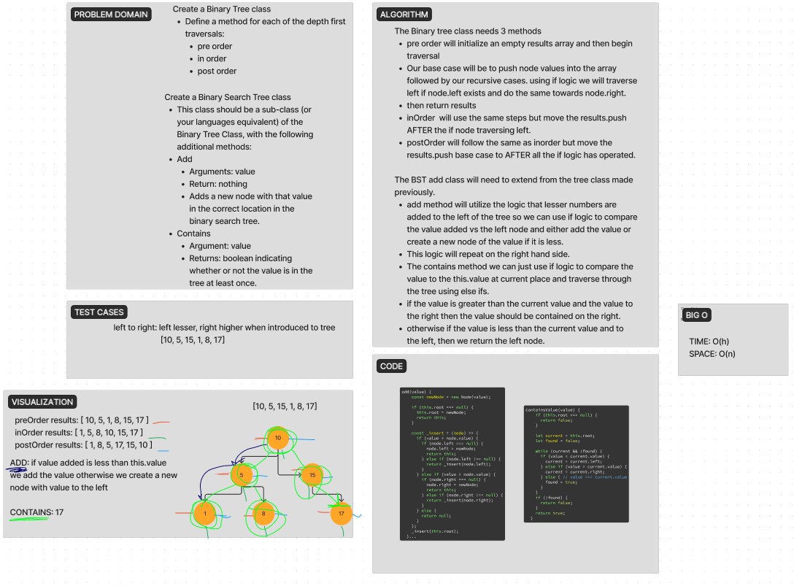

# Code Challenge 15: Binary Tree and BST Implementation
Binary Tree

    Create a Binary Tree class
        Define a method for each of the depth first traversals:
            pre order
            in order
            post order
        Each depth first traversal method should return an array of values, ordered appropriately.

Binary Search Tree

    Create a Binary Search Tree class
        This class should be a sub-class (or your languages equivalent) of the Binary Tree Class, with the following additional methods:
        Add
            Arguments: value
            Return: nothing
            Adds a new node with that value in the correct location in the binary search tree.

## Whiteboard Process

## Approach & Efficiency

Google Fu was our approach.  We were able to figure out part of the add functionality but we could not get it to pass any type of tests so we knew that it was incorrect.  There are lots of examples of how to traverse and add or complete the contain methods so we tried to use that as reference and build out a way to get to the solution on our own but we spent over 2 hours and ultimately decided to use Chat GPT to help debug and figure out what was going on.  The big o time is O(h) due to dealing with the height of a tree and the time should be O(n) on our methods.

## Solution

npm test while in the directory folder of trees

//////////////////////////////////////////////////

# Challenge Title
<!-- Description of the challenge -->

## Whiteboard Process
<!-- Embedded whiteboard image -->

## Approach & Efficiency
<!-- What approach did you take? Why? What is the Big O space/time for this approach? -->

## Solution
<!-- Show how to run your code, and examples of it in action -->

//////////////////////////////////////////////////

# Challenge Title
<!-- Description of the challenge -->

## Whiteboard Process
<!-- Embedded whiteboard image -->

## Approach & Efficiency
<!-- What approach did you take? Why? What is the Big O space/time for this approach? -->

## Solution
<!-- Show how to run your code, and examples of it in action -->

//////////////////////////////////////////////////

# Challenge Title
<!-- Description of the challenge -->

## Whiteboard Process
<!-- Embedded whiteboard image -->

## Approach & Efficiency
<!-- What approach did you take? Why? What is the Big O space/time for this approach? -->

## Solution
<!-- Show how to run your code, and examples of it in action -->

//////////////////////////////////////////////////

# Challenge Title
<!-- Description of the challenge -->

## Whiteboard Process
<!-- Embedded whiteboard image -->

## Approach & Efficiency
<!-- What approach did you take? Why? What is the Big O space/time for this approach? -->

## Solution
<!-- Show how to run your code, and examples of it in action -->

//////////////////////////////////////////////////

# Challenge Title
<!-- Description of the challenge -->

## Whiteboard Process
<!-- Embedded whiteboard image -->

## Approach & Efficiency
<!-- What approach did you take? Why? What is the Big O space/time for this approach? -->

## Solution
<!-- Show how to run your code, and examples of it in action -->
